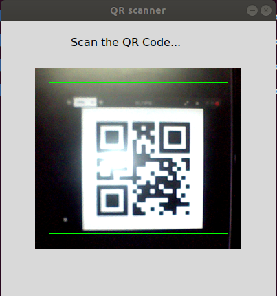
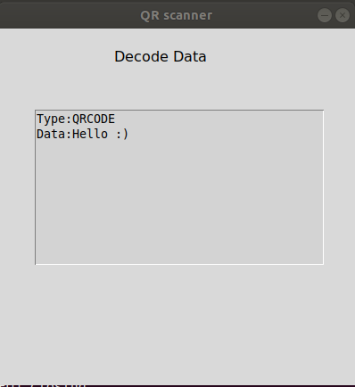

# QR And barcode scanner

<h3>Installation</h3> 
$ sudo apt-get install python3-tk 
$ sudo apt-get install libzbar0 
$ pip3 install -r requirements.txt

<h3>Usage:</h3> 
$ python3 qr_read.py 

<h3>Screenshots: </h3>

 </img>&nbsp&nbsp&nbsp&nbsp
 </img> 
 Fig:1 Scanning and Decoding Window: 

